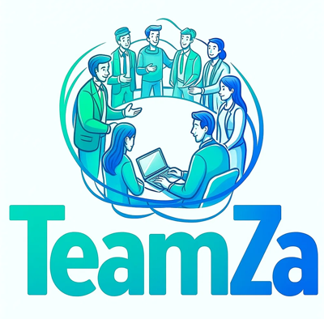

# TeamZa - AI-Powered HR Management Platform

<div align="center">
  
  
  **Revolutionary AI-powered platform that transforms talent management, employee analytics, and workforce optimization**
  
</div>

## 🚀 Overview

TeamZa is an all-inclusive, AI-driven Human Resources management software that transforms all aspects of HR functions. From smart resume filtering to predictive analytics and employee wellbeing monitoring, TeamZa offers contemporary HR teams the tools they require to drive data-driven decisions

##  Key Features

###  AI-Powered Modules

1. **AI Resume Screening**
   - Advanced NLP analysis of resumes
   - Skills extraction and job matching
   - Automated candidate ranking with 97% accuracy

2. **Smart Talent Sourcing**
   - AI-powered candidate profile generation
   - Multi-platform talent discovery
   - Intelligent candidate recommendations

3. **Leadership Potential Analysis**
   - Predictive leadership scoring
   - Growth action recommendations
   - Performance-based insights

4. **Appraisal Dashboard**
   - AI-driven performance reviews
   - Sentiment analysis of feedback
   - Comprehensive appraisal insights

5. **Learning Management System**
   - Personalized learning paths
   - Skill gap analysis
   - Progress tracking and leaderboards

6. **Employee Wellness Tracker**
   - Comprehensive health metrics
   - Wellness recommendations
   - Mental health monitoring

7. **HR Analytics & Insights**
   - Real-time workforce analytics
   - Predictive retention modeling
   - Department-wise performance metrics

8. **Gamification System**
   - Challenge-based learning
   - Achievement badges
   - XP and level progression

##  System Architecture

```
TeamZa HR Platform
├── Frontend (HTML/CSS/JavaScript)
│   ├── Bootstrap 5 UI Framework
│   ├── Chart.js for Analytics
│   └── Responsive Design
├── Backend (Flask/Python)
│   ├── SQLAlchemy ORM
│   ├── RESTful API Architecture
│   └── Modular Route Structure
├── AI/ML Components
│   ├── NLP Processing
│   ├── Sentiment Analysis
│   └── Predictive Analytics
└── Database (SQLite)
    ├── Employee Management
    ├── Performance Tracking
    └── Analytics Storage
```


### Core Models

- **Employee**: Complete employee profiles with performance metrics
- **Resume**: Resume storage and AI analysis results
- **PerformanceReview**: Performance evaluations and feedback
- **LearningProgress**: Training and skill development tracking
- **WellnessCheck**: Employee wellness and health metrics
- **HRTransaction**: Salary changes, promotions, and career events
- **Challenge/Badge**: Gamification system components


### Upcoming Features

- [ ] Advanced AI/ML models
- [ ] Trained on anonymized performance data to identify future high-potential candidates
- [ ] Semantic matching between job roles and current skills using transformer-based embeddings
- [ ] Lightweight NLP model to assess emotional tone from employee feedback.
- [ ] Natural language voice interface for initial candidate screening (using Whisper/OpenAI/Deepgram).
- [ ] Integration with popular HR systems (Workday, BambooHR)
- [ ] Mobile application for iOS and Android
- [ ] Advanced reporting and dashboard customization
- [ ] Multi-language support
- [ ] Real-time notifications and alerts


## 📁 Project Structure

```
teamza-hr-platform/
├── app.py                 # Flask application factory
├── main.py               # Application entry point
├── routes.py             # URL routing and view functions
├── models.py             # Database models
├── static/               # Static assets (CSS, JS, images)
├── templates/            # HTML templates
├── utils/                # Utility modules
│   ├── hr_analytics.py   # HR analytics engine
│   ├── nlp_processor.py  # NLP processing
│   └── document_parser.py # Document parsing utilities
├── data/                 # Data management
│   ├── mock_data.py      # Sample data generation
│   └── real_data_loader.py # Real data loading utilities
└── instance/             # Database and instance files
```


##  UI/UX Features

- **Responsive Design**: Works seamlessly across devices
- **Dark/Light Themes**: Adaptive color schemes
- **Interactive Charts**: Real-time data visualization
- **Modern UI**: Clean, professional interface
- **Accessibility**: WCAG compliant design


<div align="center">
  <p><strong>Built with ❤️ by the TeamZa Team</strong></p>
  <p>Transforming HR operations with AI-powered intelligence</p>
</div>
